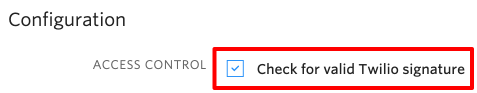

# Flex Plugin: Queue Callbacks

## Flex Plugin documentation

Twilio Flex Plugins allow you to customize the apperance and behavior of [Twilio Flex](https://www.twilio.com/flex). If you want to learn more about the capabilities and how to use the API, check out our [Flex documentation](https://www.twilio.com/docs/flex).

## Overview

During peak call volume periods, when wait time in your queues is higher than normal, it can help improve the customer experience by offering them the option of receiving a callback instead of holding. This repo gives an example of how to offer callbacks.

The Twilio Functions in this repo provide a method of offering the callback in queue using TwiML, then creating a callback task if requested.

The Flex plugin will enhance callback functionality in future iterations. For now it is just a placeholder, with the Twilio Functions providing all the core functionality.

## Dialpad Plugin Dependency

This callback example is dependent on the Flex Dialpad plugin, which you can find here:

https://github.com/lehel-twilio/plugin-dialpad

Without this plugin, the return call to the customer will not be placed when the task is accepted. The reason for depending on this plugin is because the `AcceptTask` Flex action must be overridden. This action is already overridden in the Dialpad plugin, which is commonly used by many Flex customers.

To avoid the conflict that would result from overriding `AcceptTask` in this plugin and loading both plugins together, it seemed best to rely on the Dialpad plugin. The dialing behavior in the `AcceptTask` callback in the Dialpad plugin is exactly what we need to automatically call the customer's number when the agent accepts the callback task.

Please follow the instructions in the Dialpad plugin README to deploy that plugin prior to building callback functionality.

## Twilio Functions

---
### **BETA NOTICE**

>Twilio Functions is currently available as a beta release. Some features are not yet implemented and others may be changed before the product is declared as Generally Available. Beta products are not covered by a Twilio SLA.

See [this article for more information](https://support.twilio.com/hc/en-us/articles/115002413087-Twilio-Beta-product-support?_ga=2.26835069.1957551946.1560788968-58383505.1547509695) on beta product support.

---

### Securing Your Functions

Since Twilio Functions are publicly accessible URLs, it's critical that they are secured. The Functions in this example will only receive requests from the Twilio platform directly. That being the case, be sure the box next to `Check for valid Twilio signature` is checked on each Function.



### Environment Variables

The Twilio Functions this plugin depends on require `ACCOUNT_SID` and `AUTH_TOKEN` as environment variables in the context object. There are also some custom variables required. Perform the following steps to ensure these variables are available to your functions.

1. In your Twilio Console, navigate to Runtime -> Functions -> [Configure](https://www.twilio.com/console/runtime/functions/configure)
1. Make sure the box `Enable Account_SID and AUTH_TOKEN` is checked
1. Under the `Environment Variables` section, add the following:
    * **TWILIO_WORKSPACE_SID**
      * SID of the workspace to use for creating the callback task
      * In a Flex project, there is only one workspace
      * Navigate to TaskRouter -> [Workspaces](https://www.twilio.com/console/taskrouter/workspaces) for this value
    * **TWILIO_ANYONE_WORKFLOW_SID**
      * SID of the workflow that routes to any agent
      * This can be found in Workflows after navigating to your TaskRouter Workspace
      * This is simply used as an example. In the `callback-create-task` function, you are free to specify any Workflow that you want to use for routing callbacks.
1. When done, click the Save button at the bottom of the page

### Creating the Functions

Please follow these steps for each file in the `/functions` directory before attempting to run this plugin. All Twilio Functions must be deployed prior to running the plugin or certain capabilities will not work.

1. In your code editor, select a function file in the `/functions` directory
1. Copy the file name as that will be the function name and path
1. In your Twilio Console, navigate to Runtime -> [Functions](https://www.twilio.com/console/runtime/functions/manage) 
1. Click the red plus sign to add a new Function
1. Click the `Blank` template and click `Create`
1. For the `Function Name` and `Path`, paste the Function file name you copied in step 2
1. In your code editor, copy all of the code in the selected file
1. In the Twilio Console, paste the code you just copied into the `Code` text area
1. Click the `Save` button at the bottom of the page
1. Continue with the next file in the `/functions` directory until all Functions have been created

## Studio Flow

With the Flex plugins deployed, you can now use the `callback-queue-greeting` Function as the queue entry point. The easiest way to do this is with a Studio Flow. Here are the steps to use this Function when a call enters the queue.

1. Navigate to [Studio](https://www.twilio.com/console/studio/dashboard) in the Twilio Console and open the Studio Flow you want to use for routing inbound calls. The sample one created by default is `Voice IVR` and will work for this example.
1. Select the `SendCallToAgent` Send to Flex widget
1. In the `Hold Music TwiML URL` field, enter the URL to your `callback-queue-greeting` Function
    * This URL would be in the format `https://{runtime_domain}/{function_path}`
    * If you're not sure of your runtime domain, you can navigate to the `callback-queue-greeting` Function and click the Copy button next to the Function path to copy the entire URL to your clipboard
1. After entering the `Hold Music TwiML URL`, click the Save button on the widget and then click the Publish button at the top of the Studio Flow
1. The final step is navigate to [Phone Numbers](https://www.twilio.com/console/phone-numbers/incoming) and make sure you have a phone number configured to route incoming calls to this Studio Flow

## Testing Callbacks

Here are a few notes about testing callbacks with the current iteration of the code:

* The option for a caller to enter their own number, while voiced, is not yet implemented
  * This is coming in a later iteration.
* Once the callback phone number is confirmed and the callback task is created, there will be two tasks for the caller until the initial call is disconnected
  * This will be fixed in the next iteration
* Answering the callback task should automatically trigger an outbound call to the customer's phone number
  * If this does not happen, check the browser dev tools console logs for any errors to help with troubleshooting

## Task Channel for Callbacks

This example is currenlty using the `custom1` TaskChannel. If you would like to use a different channel, that is OK. Just be sure to update the Dialpad plugin `AcceptTask` override so the call to the customer is placed automatically for the channel you define.

## Flex Plugin

### Setup

Make sure you have [Node.js](https://nodejs.org) as well as [`npm`](https://npmjs.com) installed.

Afterwards install the dependencies by running `npm install`:

```bash
cd 

# If you use npm
npm install
```

### Development

In order to develop locally, you can use the Webpack Dev Server by running:

```bash
npm start
```

This will automatically start up the Webpack Dev Server and open the browser for you. Your app will run on `http://localhost:8080`. If you want to change that you can do this by setting the `PORT` environment variable:

```bash
PORT=3000 npm start
```

When you make changes to your code, the browser window will be automatically refreshed.

### Deploy

Once you are happy with your plugin, you have to bundle it, in order to deply it to Twilio Flex.

Run the following command to start the bundling:

```bash
npm run build
```

Afterwards, you'll find in your project a `build/` folder that contains a file with the name of your plugin project. For example `plugin-example.js`. Take this file and upload it into the Assets part of your Twilio Runtime.

Note: Common packages like `React`, `ReactDOM`, `Redux` and `ReactRedux` are not bundled with the build because they are treated as external dependencies so the plugin will depend on Flex which would provide them globally.